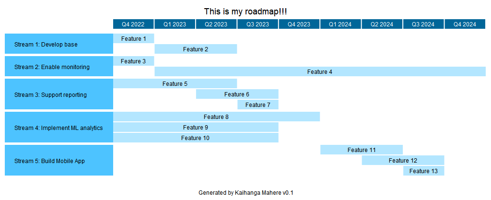

# roadmap_generator

Purpose: This application is used to generate graphical roadmap using code. 

Mahere Kaihanga means roadmap generator in Maori language.

## Example  
```
    x = MahereKaihanga()
    x.Title = "This is my roadmap"

    x.Tasks = [
                {"group": "Phase 1: Develop base", "colour": "lightgreen", "tasks": [
                    {"task": "Feature 1", "start": datetime.datetime(2022, 10, 24), "end": datetime.datetime(2022, 11, 24), "colour": "lightgreen"},
                    {"task": "Feature 2", "start": datetime.datetime(2022, 12, 24), "end": datetime.datetime(2023, 4, 24), "colour": "lightgreen"}
                    ]},
                {"group": "Phase 2: Enable monitoring", "colour": "lightgreen", "tasks": [
                    {"task": "Feature 3", "start": datetime.datetime(2022, 4, 24), "end": datetime.datetime(2022, 12, 24), "colour": "lightblue"},
                    {"task": "Feature 4", "start": datetime.datetime(2023, 1, 24), "end": datetime.datetime(2024, 12, 24), "colour": "lightblue"}
                    ]},
                {"group": "Phase 3: Support reporting", "colour": "lightgreen", "tasks": [
                    {"task": "Feature 5", "start": datetime.datetime(2022, 10, 24), "end": datetime.datetime(2023, 3, 24), "colour": "yellow"},
                    {"task": "Feature 6", "start": datetime.datetime(2023, 4, 24), "end": datetime.datetime(2023, 7, 24), "colour": "yellow"},
                    {"task": "Feature 7", "start": datetime.datetime(2023, 8, 24), "end": datetime.datetime(2023, 8, 24), "colour": "yellow"}
                ]}              
            ]
    x.render("my_roadmap.png")
```

