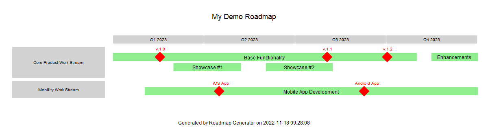
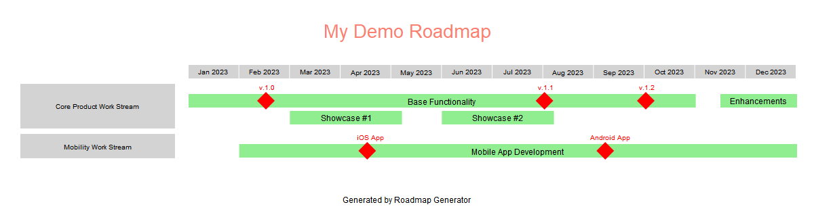

# roadmap_generator

Purpose: This python class library is used to generate graphical roadmap using code.

## Code Example

```python
roadmap = Roadmap(1200, 312)
roadmap.set_title("My Demo Roadmap")
roadmap.set_timeline(TimelineMode.MONTHLY, "2023-02-01", 12)
with roadmap.add_group("Core Product Work Stream") as group:
    with group.add_task("Base Functionality", "2022-11-01", "2023-10-31") as task:
        task.add_milestone("v.1.0", "2023-02-15")
        task.add_milestone("v.1.1", "2023-08-01")
        task.add_milestone("v.1.2", "2023-09-30")
    with task.add_parellel_task("Enhancements", "2023-11-15", "2024-03-31") as task1a:
        task1a.add_milestone("v.2.0", "2024-03-30")
    with group.add_task("Showcase #1", "2023-03-01", "2023-05-07") as task:
        with task.add_parellel_task("Showcase #2", "2023-06-01", "2023-08-07") as parellel_task:
            pass

with roadmap.add_group("Mobility Work Stream") as group:
    with group.add_task("Mobile App Development", "2023-02-01", "2024-12-07") as task:
        task.add_milestone("iOS App", "2023-04-15")
        task.add_milestone("Android App", "2023-09-07")

roadmap.set_footer("Generated by Roadmap Generator")
roadmap.draw()
roadmap.save("demo01.png")
```

### Output


## Timeline can be changed by changing the mode

Quarterly Mode:
```python
roadmap.set_timeline(TimelineMode.QUARTERLY, "2023-02-01", 4)
```

### Output


Other timeline modes available are:
* TimelineMode.WEEKLY
* TimelineMode.MONTHLY
* TimelineMode.QUARTERLY
* TimelineMode.HALF_YEARLY
* TimelineMode.YEARLY


## Font, font size, font colour and fill colour can be changed

```python
# Uses default colour scheme, font and font size
roadmap.set_title("My Demo Roadmap")

# Change font colour, but use default font and font size
roadmap.set_title("My Demo Roadmap", font_colour="Salmon")

# Change font colour, font and font size
roadmap.set_title("My Demo Roadmap", font_colour="Salmon", font="Arial", font_size=18)
```

### Output



